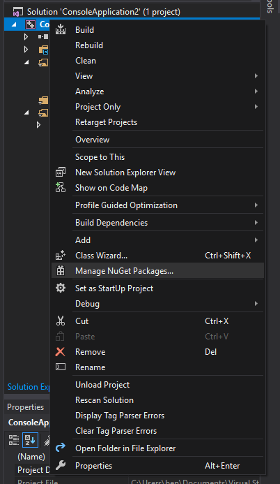
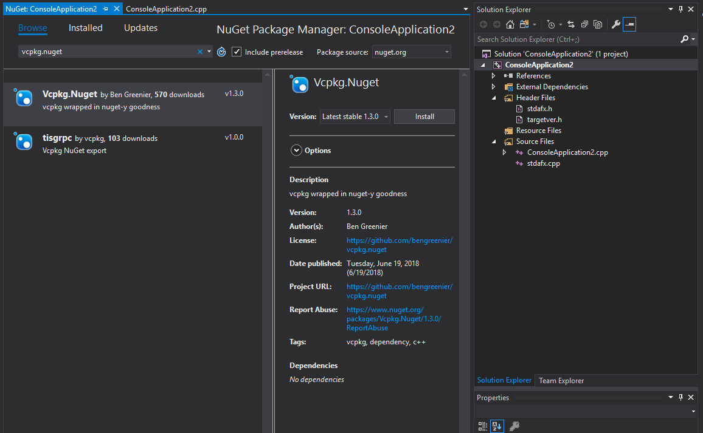
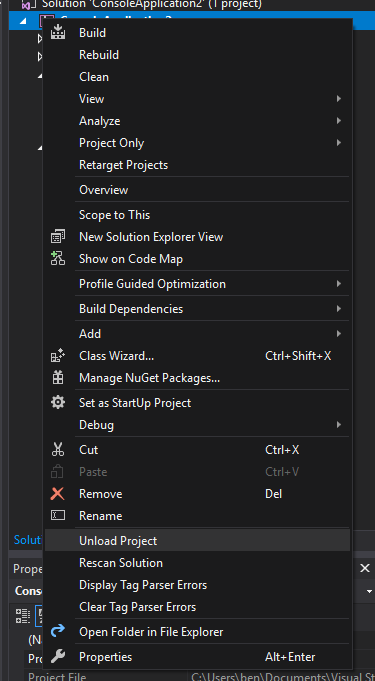
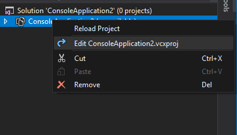
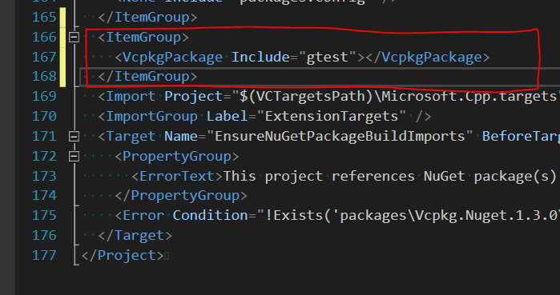
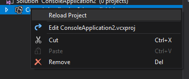

# vcpkg.nuget-example

An example __msbuild__ `c++` project that leverages [vcpkg.nuget](https://github.com/bengreenier/vcpkg.nuget) for dependencies

## Usage

> Note: This is simply a demo app, as such it doesn't do much :smile_cat:

```
 λ ./ExampleApp
 λ ./ExampleApp -h
  ./ExampleApp {OPTIONS}

    This is a test program. 

  OPTIONS:

      -h, --help         Display this help menu 

    This goes after the options. 
 λ 
```

## Walkthrough

<details>
<summary>Creating a new Visual Studio Project</summary>

Create a new project following [these instructions](https://docs.microsoft.com/en-us/cpp/windows/walkthrough-creating-a-standard-cpp-program-cpp?view=vs-2017).

</details>

<details>
<summary>Adding Vcpkg.nuget</summary>

+ Open the "Manage Nuget Packages..." pane



+ In the "Browse" tab, search for "Vcpkg.Nuget"



+ In the Description area, click "Install" to install the package :tada:

</details>

<details>
<summary>Configuring Vcpkg.nuget</summary>

+ Unload your project



+ Edit your project



+ Append an `ItemGroup` with `VcpkgPackage` entries (one for each port)



+ Reload your project



</details>

<details>
<summary>Building</summary>

Build your project as normal - you'll notice Build Output for vcpkg is now in place:

```
1>------ Build started: Project: ExampleApp, Configuration: Release Win32 ------
1>Running vcpkg...
1>The following packages will be built and installed:
1>    args[core]:x86-windows
1>Starting package 1/1: args:x86-windows
1>Building package args[core]:x86-windows...
1>-- Using cached C:/Users/begreen/git/vcpkg.nuget-example/packages/Vcpkg.Nuget.1.4.0/vcpkg_bin/downloads/Taywee-args-3de44ec671db452cc0c4ef86399b108939768abb.tar.gz
1>-- Extracting source C:/Users/begreen/git/vcpkg.nuget-example/packages/Vcpkg.Nuget.1.4.0/vcpkg_bin/downloads/Taywee-args-3de44ec671db452cc0c4ef86399b108939768abb.tar.gz
1>-- Using source at C:/Users/begreen/git/vcpkg.nuget-example/packages/Vcpkg.Nuget.1.4.0/vcpkg_bin/buildtrees/args/src/8939768abb-c475611d5d
1>-- Configuring x86-windows
1>-- Up-to-date: C:/Users/begreen/git/vcpkg.nuget-example/packages/Vcpkg.Nuget.1.4.0/vcpkg_bin/packages/args_x86-windows/include
1>-- Installing: C:/Users/begreen/git/vcpkg.nuget-example/packages/Vcpkg.Nuget.1.4.0/vcpkg_bin/packages/args_x86-windows/include/args.hxx
1>-- Installing: C:/Users/begreen/git/vcpkg.nuget-example/packages/Vcpkg.Nuget.1.4.0/vcpkg_bin/packages/args_x86-windows/include/examples
1>-- Installing: C:/Users/begreen/git/vcpkg.nuget-example/packages/Vcpkg.Nuget.1.4.0/vcpkg_bin/packages/args_x86-windows/include/test
1>-- Performing post-build validation
1>-- Performing post-build validation done
1>Building package args[core]:x86-windows... done
1>Installing package args[core]:x86-windows...
1>Installing package args[core]:x86-windows... done
1>Elapsed time for package args:x86-windows: 9.462 s
1>
1>Total elapsed time: 9.462 s
1>
1>ExampleApp.cpp
1>Generating code
1>All 1789 functions were compiled because no usable IPDB/IOBJ from previous compilation was found.
1>Finished generating code
1>ExampleApp.vcxproj -> C:\Users\begreen\git\vcpkg.nuget-example\Release\ExampleApp.exe
========== Build: 1 succeeded, 0 failed, 0 up-to-date, 0 skipped ==========
```
</details>